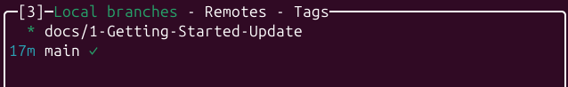

--p-
title: Creating Markdown Documents
---

# Let's Begin
Markdown is a simple markup language for formatting documents easily. Benefits of markdown for documentation are its simplistic to focus on the narrative you are writing and ability to run almost anywhere without issue.

!!! info "We recommend using Visual Code for writing Markdown documents"

## GitHub Cloning and Branching
To begin using the E-Waste Battery Extraction documentation application MkDocs you have to clone the repository first.
```Bash
git clone git@github.com:222038631/e-waste-battery-extraction-UAT.git
```
Once cloned please create a branch starting with - **docs/**


## Navigating The File System
When creating your first document, locate your respected sub-team folder and began your first Markdown file adventure.

We encourage to create sub-folders within your respected team folders to further organise your documentation by any category you wish. MkDocs will automatically demonstrate a clearer presentation of those categories.

!!! info "Importing Images"
    MkDocs and Markdown support image processing in your documents. Please note if you are adding images please add them into your sub-teams respected image folders to maintain a clear repository.

```
E-Waste Battery Extract Documents
├── docs
│   ├── Computer-Vision
│   ├── Getting-Started
│   ├── images
│   ├── index.md
│   ├── robotics
│   └── Systems-and-Simulation
├── env
├── mkdocs.yml
└── requirements.txt
```

## Your First Document
To create your first markdown document you simple need to rename an empty file type to **.md**
```Bash
example.md
```
!!! info "PDF to Markdown"
    If you have already created documentations within a Word or PDF format, there are online options available to convert PDF to Markdown.

Opening the markdown file in any code editor (e.g., visual code) and begin typing your document.
??? tip "Spell-Check Enabled"
    It is recommended to have spell-check plugins enabled on your code editors when writing Markdown if you wish.    

### The following below are the Markdown syntax:
```MarkDown
# Heading

## Sub-Heading

### Sub-Sub-Heading


- List Item
    - Sub-List Item
* List Item
- [] Checklist Item
- [x] Checklist Item
```

### Markdown Example
```
---
title: Title for MkDocs to Use
---

# Example Document Title
Sunt quia pariatur tempore amet. Non consequuntur quod enim asperiores. 
Est in eum quo est. Eum eligendi iste quo cupiditate qui. Expedita voluptas 
id cupiditate explicabo id. Eveniet ipsam quam dignissimos error laboriosam.

## Sub-Example Heading
The following images showcas 

```

### Viewing Markdown in the Browser
Not all code editors or web-browser may render MarkDown correctly. To resolve this your code editors may have add-ons/plugins to allow appropriate viewing (Visual Code is recommended). 

Otherwise within your web-browser there are extensions that will render Markdown appropriately.

??? tip "Additionally, you may run mkdocs locally if you wish to see how your document would appear in MkDocs."
    [Run MkDocs Locally](running-locally.md)

